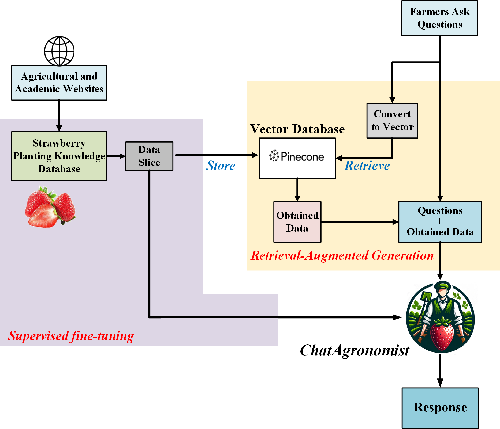
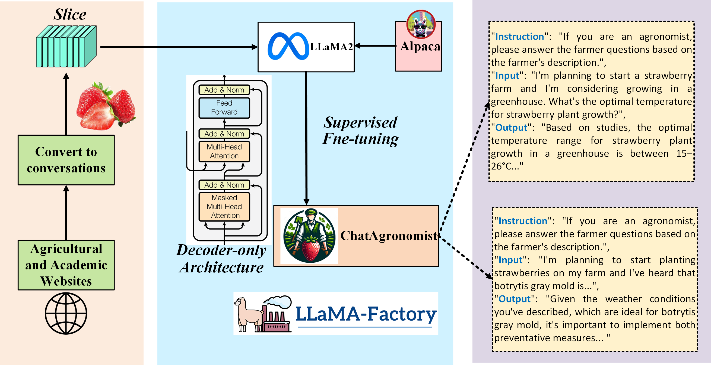
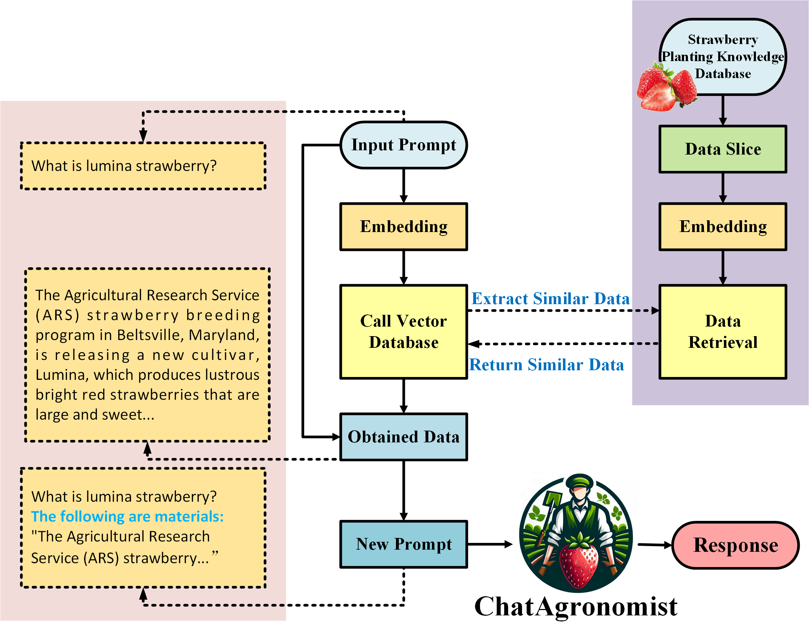

# ChatAgronomist: A Specialized Large Language Model for Strawberry Production Support

Zhihao Cao, Zhenfeng Jiang, Yong Wang, Hongchun Qu

  

The pre-trained model Llama 2 [Llama 2-7B](https://drive.google.com/file/d/1lyfqIwlLSClhgrCutWuEe_IACNq6XNUt/view?usp=sharing).

The LLaMA-Factory platform [LLaMA-Factory](https://github.com/hiyouga/LLaMA-Factory).

## Requirement

| Mandatory       | Recommend |
| --------------- | --------- |
| openai          | 0.28.1    |
| torch           | 2.2.0     |
| transformers    | 4.39.3    |
| pinecone-client | 2.2.4     |
| tiktoken        | 0.6.0     |
| langchain       | 0.0.292   |
| unstructured    | 0.10.30   |

